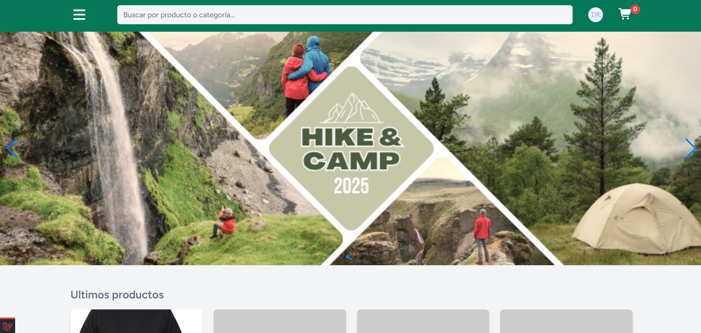
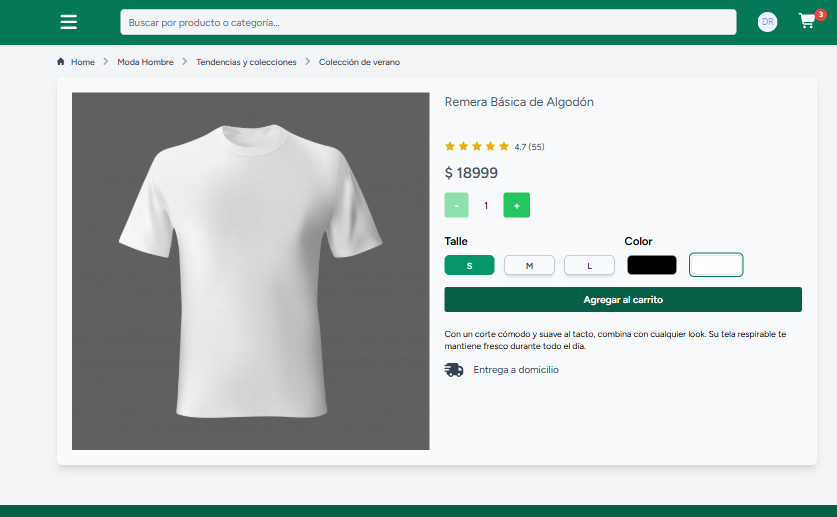
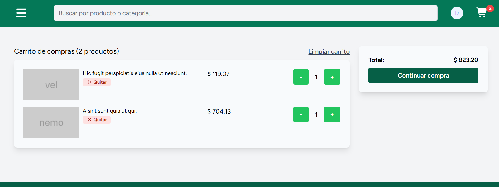
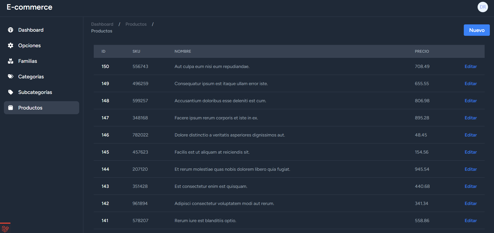
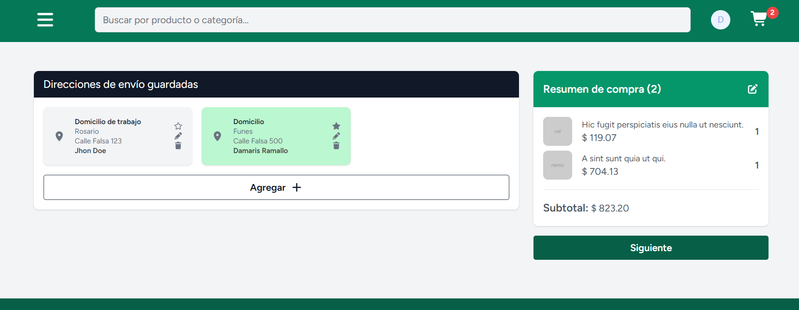

# 🛒 E-commerce — Tienda online con panel de administración

> Tienda online completa hecha con Laravel y Livewire: catálogo con variantes (talle/color), carrito persistente, direcciones de envío y un panel de administración para gestionar todo el contenido sin tocar código.



🚧 **Estado:** en desarrollo. La demo en vivo estará disponible cuando el proyecto esté deployado.

> Mientras tanto, podés correrlo en local siguiendo las [instrucciones de instalación](#-instalación-local).

---

##  Funcionalidades

### Tienda (cliente)
- Catálogo de productos organizado por familias, categorías y subcategorías.
- Productos con variantes (talle, color) y selección de cantidad.
- Carrito de compras persistente: se guarda en base de datos y mantiene el contador de ítems.
- Resumen del carrito.
- Registro e inicio de sesión de usuarios.
- Módulo de direcciones: alta, listado, dirección por defecto, edición y eliminación.
- Diseño responsive (mobile first).

### Panel de administración
- CRUD de familias, categorías, subcategorías y productos.
- Gestión de variantes y opciones de producto.
- Gestión de portadas/banners con reordenamiento *drag & drop*.
- Formularios dependientes (selects en cascada) con Livewire.

### Próximamente
- [ ] Integración de pasarela de pago
- [ ] Historial de pedidos
- [ ] Tests automatizados

---

##  Stack tecnológico

| Capa | Tecnología |
|------|------------|
| Backend | Laravel 13, PHP |
| Interactividad | Livewire, Alpine.js, JavaScript |
| Estilos | Tailwind CSS |
| Autenticación | Laravel Jetstream |
| Base de datos | MySQL |
| Carrito | codersfree/shoppingcart |
| Extras | SortableJS + Axios (vía CDN) |
| Entorno local | Laragon |

---

## 🚀 Instalación local

### Requisitos
- PHP 8.3+
- Composer
- Node.js 20+ y npm
- MySQL

### Pasos

```bash
# 1. Clonar el repositorio
git clone https://github.com/damarisramallo/e-commerce.git
cd e-commerce

# 2. Instalar dependencias
composer install
npm install

# 3. Configurar variables de entorno
cp .env.example .env
php artisan key:generate

# 4. Crear la base de datos y configurar el .env (ver abajo)
php artisan migrate --seed

# 5. Enlace simbólico para imágenes
php artisan storage:link

# 6. Levantar el proyecto
npm run dev
php artisan serve
```

### Variables de entorno necesarias

```env
APP_NAME="E-commerce"
APP_URL=http://localhost:8000

DB_CONNECTION=mysql
DB_HOST=127.0.0.1
DB_PORT=3306
DB_DATABASE=ecommerce
DB_USERNAME=root
DB_PASSWORD=
```

> ⚠️ El archivo `.env` está en el `.gitignore`. Nunca subas credenciales al repositorio.

---

## 🧠 Decisiones técnicas

- **Livewire en lugar de una SPA:** quería interactividad (selects en cascada, carrito, formularios dinámicos) sin duplicar la lógica en un frontend separado. Livewire me permitió mantener el estado y las validaciones en el servidor, y Alpine.js cubre las interacciones livianas del lado del cliente.
- **Carrito persistente en base de datos:** el carrito se guarda en la DB para que el usuario no lo pierda al cerrar sesión o cambiar de dispositivo.
- **Compatibilidad con Laravel 13:** el paquete del carrito solo declaraba soporte hasta `illuminate/support ^12.0`, así que lo integré con un override de repositorio tipo `package` en `composer.json`, incluyendo el bloque `extra.laravel` para que el ServiceProvider se auto-registre.
- **Observers para lógica automática:** usé un `CoverObserver` para asignar el orden de las portadas al crearlas, evitando repetir esa lógica en los componentes.
- **Reordenamiento drag & drop:** SortableJS + Axios por CDN, para no sumar complejidad de build a una funcionalidad puntual.
- **Qué haría distinto con más tiempo:** agregar tests (feature tests para el carrito y el CRUD), mover la lógica de negocio más pesada a *Actions/Services* y sumar caché al catálogo.

---

## 📁 Estructura del proyecto

```
app/
├── Livewire/        # Componentes (admin y tienda)
├── Models/          # Modelos Eloquent
├── Observers/       # Lógica automática sobre modelos
resources/
├── views/           # Vistas Blade y Livewire
├── js/ · css/       # Assets (Alpine, Tailwind)
database/
├── migrations/
└── seeders/
```

---

## 📸 Capturas

| Home | Producto | Carrito |
|------|----------|---------|
|  |  |  |

| Panel admin | Direcciones |
|-------------|-------------|
|  |  |

---

## 👩‍💻 Autora

**Dámaris Ramallo** — Analista de sistemas y desarrolladora fullstack

- 🌐 Portfolio: [damarisramallo.com](https://damarisramallo.com)
- 💼 LinkedIn: [linkedin.com/in/damarisramallo](https://www.linkedin.com/in/damarisramallo)
- 🐙 GitHub: [@damarisramallo](https://github.com/damarisramallo)
